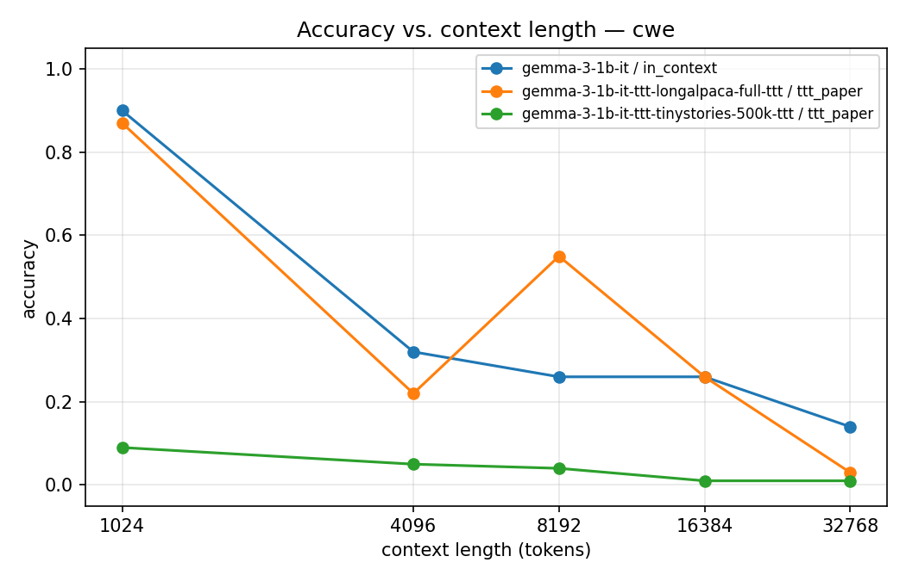
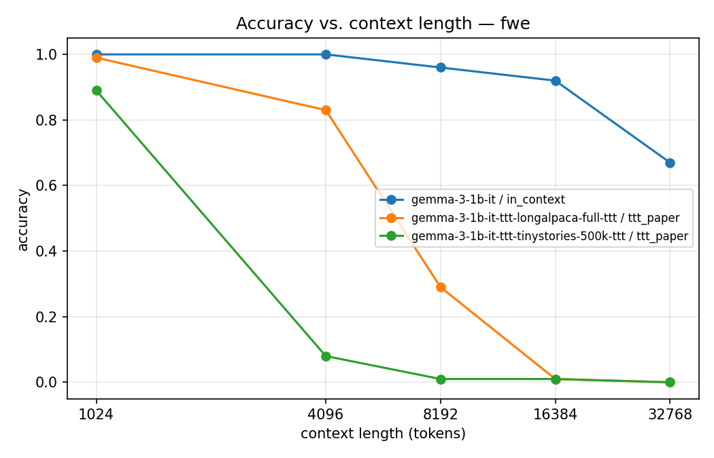
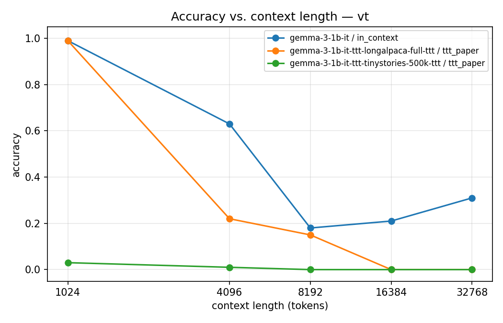
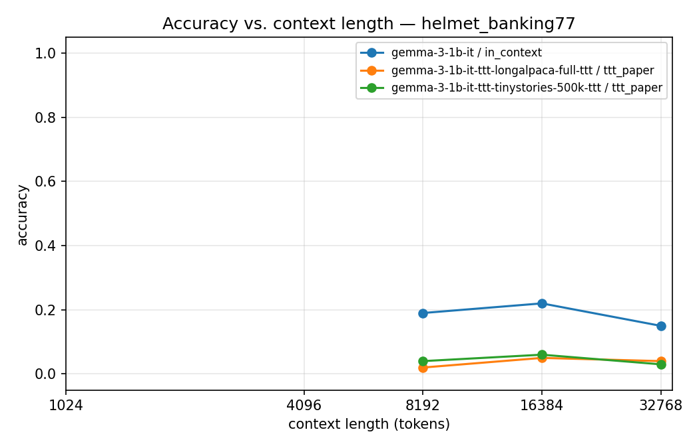
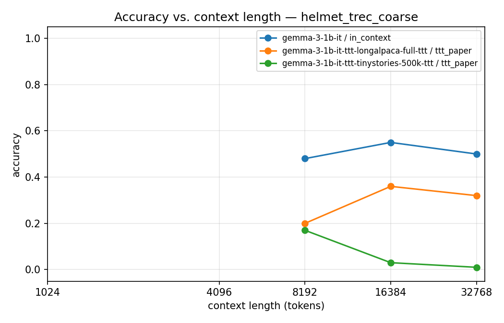
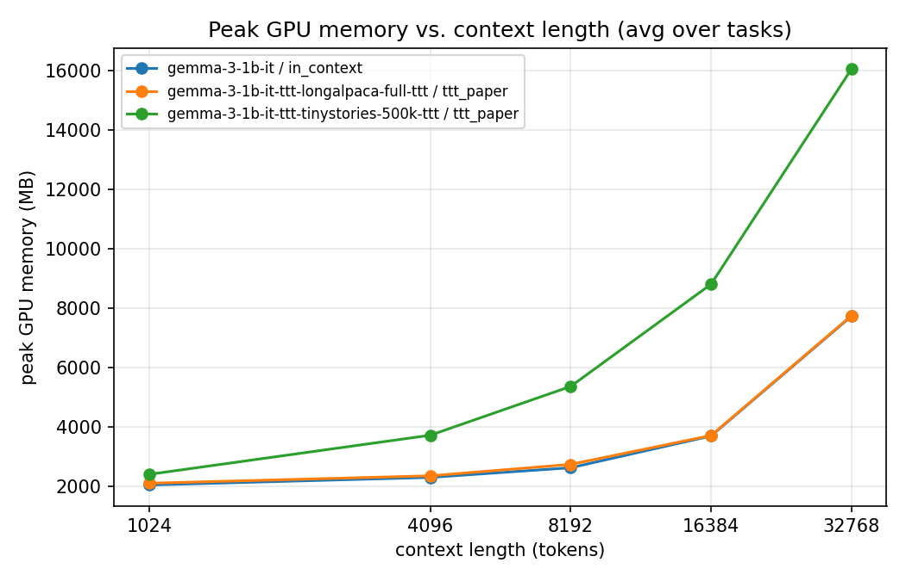
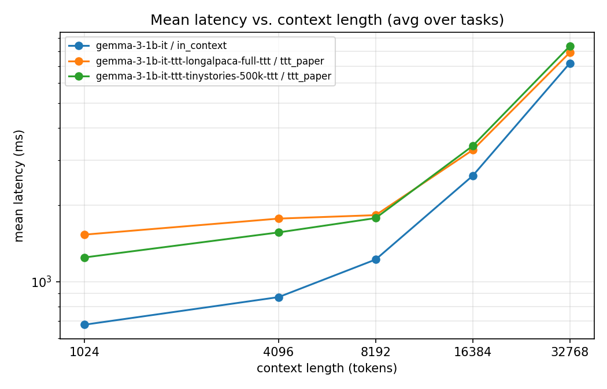

# Adapter-Only In-Place Test-Time Training

Isolating the contribution of fast-weight target modules in frozen LLMs, on Gemma3-1B.

[Original In-Place TTT paper (Feng et al.)](https://arxiv.org/pdf/2604.06169)

## Motivation

The In-Place Test-Time Training (In-Place TTT) paper trains the base model and TTT modules jointly during continual pretraining (~20B tokens at 32K context on H800s). This leaves an open question: how much of the long-context gain comes from the **TTT adapter modules** (Conv1D, W_target) learning a useful next-token-prediction target, versus the **base model co-adapting** to tolerate the dynamic weight updates?

We isolate the first contribution by **freezing the base model and training only the TTT adapter modules**, then comparing against vanilla Gemma3 on RULER-style long-context tasks.

## Approach

Use `google/gemma-3-1b-it` (26 layers, hidden 1152, GeGLU MLPs with intermediate 6912, 32K context) as the base. We implement In-Place TTT as a drop-in enhancement: a `Conv1D` + `W_target` adapter is added to the MLP of the global-attention layers `[0, 6, 12, 18, 24]`, gated on `config.use_ttt`.

We **skip continual pretraining entirely** and pretrain the adapter only. The base model is fully frozen except for the `down_proj` (W_down) of the TTT layers — that surface is the one the per-chunk ΔW updates, so it is trained jointly with `Conv1D` + `W_target`. Every other parameter (embeddings, attention, gate/up_proj, norms, lm_head, and the down_proj of all non-TTT layers) is `requires_grad=False`.

Primary training corpus: **500k samples of `roneneldan/TinyStories`** (short narratives, ~2M total). `Yukang/LongAlpaca-12k` is also supported as a long-context variant — note it caps at **12k samples**, so we run it for 2 epochs by default to compensate.

### Evaluation

Three modes, each run on the same example set:

- **`in_context`** — vanilla Gemma3; prompt is `[doc, q]`, single forward.
- **`ttt_paper`** — same `[doc, q]` prompt, but TTT layers update their fast weights chunk-by-chunk during prefill (matches the original paper's eval).
- **`ttt_strict`** — two-phase: ingest doc only and snapshot the per-layer ΔW, then answer `q` alone with that snapshot patched in. Doc is absent at answer time, so the fast weights must substitute for context.

Tasks come from RULER (`vt`, `cwe`, `fwe`) and HELMET ICL/RAG (`helmet_trec_coarse`, `helmet_banking77`, `helmet_nq`, `helmet_hotpotqa`), tested at 1K / 4K / 8K / 16K / 32K context lengths. Metrics: accuracy, peak GPU memory, latency. See [`benchmark/README.md`](benchmark/README.md).

**NOTE**: `StrictTTTPredictor` does not work with the updated HELMET-based evaluation. 

## Repository layout

```
In-Place-Test-Time-Training/
├── models/hf_gemma3/
│   ├── config_gemma3.py         # Gemma3TTTConfig: subclasses upstream Gemma3TextConfig, adds TTT fields
│   ├── model_gemma3.py          # Gemma3MLPTTT, Gemma3DecoderLayerTTT, Gemma3TextModelTTT, Gemma3ForCausalLMTTT
│   └── test_gemma3.py           # pytest suite: instantiation, forward, generate, save/load round-trip, freeze
├── train/
│   ├── main.py                  # training entry point (frozen base + TTT-adapter pretraining)
│   ├── test_main.py             # pytest suite: tokenize, freeze, save, wandb, CLI plumbing
│   └── README.md                # training details, default hyperparameters, Colab walkthrough
├── benchmark/                   # eval harness (configs, data_gen, eval, scripts, results/plots)
├── scripts/                     # misc utilities (prompt dumping, eval shell helpers)
├── third_party/
│   ├── RULER/                   # NVIDIA RULER (submodule)
│   └── HELMET/                  # Princeton HELMET (submodule)
├── Makefile                     # convenience commands (see `make help`)
├── pyproject.toml               # deps managed by uv
├── LICENSE                      # Apache 2.0
└── NOTICE                       # attribution to HuggingFace, Google (Gemma), Bytedance (TTT reference)
```

### Modeling code, in detail

`model_gemma3.py` mirrors upstream `transformers.models.gemma3.modeling_gemma3` and adds:

- `TTTLinear`, `TTTConv1d` — marker subclasses of `nn.Linear` / `nn.Conv1d` so `_init_weights` can identify TTT modules unambiguously (avoids shape collisions with `q_proj`/`o_proj`).
- `Gemma3MLPTTT` — Gemma3 MLP with optional `ttt_proj` (W_target) + `ttt_conv` modules, chunked TTT update in `forward(x, t=...)`.
- `Gemma3DecoderLayerTTT` — Gemma3 decoder layer, near-mirror of upstream; only delta is a `target_states` kwarg threaded into `mlp(...)`.
- `Gemma3PreTrainedModelTTT` — inherits from upstream `Gemma3PreTrainedModel`. Custom `_init_weights` does diagonal init for `TTTLinear` (near-identity) and zero init for `TTTConv1d` (no-op start), and defers everything else to `super()` so `_is_hf_initialized` skip-flags are honored and loaded checkpoints aren't trampled.
- `Gemma3TextModelTTT`, `Gemma3ForCausalLMTTT` — backbone + LM head. `freeze_base_model()` on the LM keeps `ttt_proj` (W_target), `ttt_conv`, and the `down_proj` (W_down) of the **TTT layers only** trainable; every other parameter — including `down_proj` on non-TTT layers — is `requires_grad=False`.

When `config.use_ttt=False`, the TTT branches are skipped entirely and the model behaves identically to upstream Gemma3.

## Setup

```bash
make install       # uv sync --all-groups + RULER submodule + nltk data + PG-essay haystack
make test          # fast tests over models/ and train/ (skips @slow)
make test-slow     # downloads google/gemma-3-1b-it; needs HF auth + Gemma TOU acceptance
```

## Loading the model

### From scratch (random TTT init on top of Gemma3 base)

```python
from models.hf_gemma3 import Gemma3ForCausalLMTTT, Gemma3TTTConfig

config = Gemma3TTTConfig.from_pretrained(
    "google/gemma-3-1b-it",
    use_ttt=True,
    ttt_layers=[0, 6, 12, 18, 24],   # global layers in Gemma3-1B
    ttt_chunk=2048,
    ttt_lr=0.3,
)
model = Gemma3ForCausalLMTTT.from_pretrained("google/gemma-3-1b-it", config=config)
model.freeze_base_model()            # ttt_proj, ttt_conv, and down_proj on TTT layers get gradients
```

### From a trained checkpoint (local)

```python
model = Gemma3ForCausalLMTTT.from_pretrained("./checkpoints/gemma3-1b-ttt")
```

### From the HuggingFace Hub

```python
from transformers import AutoModelForCausalLM
model = AutoModelForCausalLM.from_pretrained(
    "yourname/gemma3-1b-ttt",
    trust_remote_code=True,          # custom modeling code lives in the Hub repo
)
```

`trust_remote_code=True` is required because `Gemma3ForCausalLMTTT` is not part of upstream `transformers`.

#### HF Repos
- https://huggingface.co/hungngo04/gemma-3-1b-it-ttt-tinystories-500k
- https://huggingface.co/changminbark/gemma-3-1b-it-ttt-longalpaca-full


## Training

`train/main.py` pretrains the TTT adapters (`ttt_conv`, `ttt_proj`/W_target) and the TTT-layer `down_proj` (W_down) on a single dataset selected via `--dataset`, then pushes the result to the Hub (bundled with the modeling code + `auto_map`).

```bash
# Primary run: 500k TinyStories samples
make train-tinystories HF_USER=<you>
# Long-context variant
make train-longalpaca  HF_USER=<you>
# or directly:
uv run python -m train.main --dataset tinystories --hf-user <you> --max-samples 500000
uv run python -m train.main --dataset longalpaca  --hf-user <you>
```

Supported datasets: `tinystories` (`roneneldan/TinyStories`) and `longalpaca` (`Yukang/LongAlpaca-12k`). See [`train/README.md`](train/README.md) for the full table of default hyperparameters, every CLI flag, wandb setup, and a Colab walkthrough.

## Pushing to the HuggingFace Hub

`train/main.py` handles this automatically: it sets `auto_map`, copies `config_gemma3.py` + `model_gemma3.py` next to the weights, and pushes to `<hf-user>/<base>-ttt-<dataset>` (override with `--repo-id`). Authenticate once with `make login-hf`. Use `--no-push` to skip the upload.

For manually-built checkpoints, `make push-hub HF_REPO_ID=... CKPT_DIR=...` is still available; the repo must contain `config.json` with an `auto_map` block, the two `.py` modeling files, weights, and ideally a model card noting the Gemma base license. See HuggingFace's [custom code documentation](https://huggingface.co/docs/transformers/custom_models) for the standard layout.

## Evaluation

```bash
uv run python -m benchmark.scripts.generate --profile dev
uv run python -m benchmark.scripts.evaluate --profile dev --predictor benchmark.eval.factories:gemma3_in_context_factory
uv run python -m benchmark.scripts.evaluate --profile dev --predictor benchmark.eval.factories:gemma3_ttt_paper_factory
uv run python -m benchmark.scripts.evaluate --profile dev --predictor benchmark.eval.factories:gemma3_ttt_strict_factory
uv run python -m benchmark.scripts.aggregate
uv run python -m benchmark.scripts.report
uv run python -m benchmark.scripts.plot
```

Runs the three modes described above and reports accuracy, peak GPU memory, and latency as a function of context length. The harness lives under `benchmark/` (configs, data_gen, eval, scripts) and pulls tasks from NVIDIA RULER and Princeton HELMET (`third_party/`). See [`benchmark/README.md`](benchmark/README.md) for setup, profiles (`dev`/`full`), and how to register new predictors.

## Make targets

Run `make help` for the full list. Highlights:

| Target | Description |
| --- | --- |
| `make install` | `uv sync --all-groups` |
| `make test` | fast pytest suite (skips slow) |
| `make test-slow` | downloads real Gemma3-1B and exercises the load path |
| `make train DATASET=...` | trains on `tinystories`/`longalpaca` and pushes (`HF_USER=...`) |
| `make train-tinystories` / `make train-longalpaca` | dataset-specific shortcuts |
| `make eval` | runs the benchmark pipeline (see [`benchmark/README.md`](benchmark/README.md)) |
| `make login-hf` | `huggingface-cli login` |
| `make push-hub` | upload `$(CKPT_DIR)` to `$(HF_REPO_ID)` |
| `make clean` | nuke `__pycache__`, `.pytest_cache`, etc. |

## Tech stack

PyTorch, HuggingFace Transformers, NVIDIA RULER, HuggingFace Datasets, Weights & Biases.

## Research question

> Can the TTT adapter modules (Conv1D, W_target) be trained while keeping the base model frozen, and still recover some fraction of the long-context gains reported in the paper?

## Expected outcomes

- Adapter-enhanced model matches the baseline at short contexts (no damage to base capability).
- Improves over baseline at longer contexts, but by a smaller margin than the paper's fully-trained variant.
- The size of that gap quantifies how much of the paper's reported gains require base-model co-adaptation.
- A finding of no improvement (or degradation) is itself a meaningful negative result: it would say the base model's adaptation is load-bearing, not just the adapter's learned target.

## Results and Discussion

Full report: [Adapter-Only In-Place Test-Time Training: Isolating the Contribution of Fast-Weight Target Modules in Frozen LLMs](https://docs.google.com/document/d/1dlbFZoXnsHY0ySqQcskGcF4c9CfdM7oXekZFgsyXP3E/edit?tab=t.yntkf9m41rao). Plot sources are under [`benchmark/results/plots/`](benchmark/results/plots/).

After pretraining 2 In-Place Test-Time Training MLP layers on TinyStories (500K samples) and LongAlpaca (2×12K samples), we ran evaluations against the HELMET+RULER inspired benchmark, which excluded LLM-as-a-Judge metrics.

### Accuracy vs. context length

| Common Words Extraction (CWE) | Frequent Words Extraction (FWE) |
| --- | --- |
|  |  |

| Variable Tracking (VT) | HELMET — Banking77 |
| --- | --- |
|  |  |

| HELMET — TREC Coarse | |
| --- | --- |
|  | |

As shown in the plots, on all evaluation tasks the "vanilla" Gemma3 (in-context) outperforms the In-Place TTT Gemma3 models. The one discrepancy to note is that the LongAlpaca-trained model performs better than the vanilla model on the Common Words Extraction (CWE) task at the input context of 8192 tokens. It may be possible that the LongAlpaca dataset is constructed in a way that aligns the In-Place TTT MLP layers to be better at this specific task and context length. This should be investigated further.

### Peak GPU memory and latency

| Peak GPU memory | Mean latency |
| --- | --- |
|  |  |

In terms of peak GPU memory, the TinyStories model had significantly higher usage compared to the other two models. This is most likely due to the fact that the TinyStories model had a much smaller TTT chunk size (128) compared to the LongAlpaca model's TTT chunk size (2048). The smaller TTT chunk size means the TinyStories model has to create more chunk deltas and updates than the LongAlpaca one, leading to higher GPU memory usage.

Mean latency among the In-Place TTT models is similar and higher than the vanilla model, which makes sense as the new architecture adds more calculations like computing update deltas, aggregating them through cumsum, and then applying them to get the MLP output (see Algorithm 1 in the appendix of the original paper).

### Takeaways

As it stands, pretraining In-Place TTT MLP layers while freezing the base model does not lead to improvement in performance. These findings, however, are limited to just the Gemma3 model, where the In-Place TTT MLP layers were implemented in the global attention layers. Furthermore, pretraining of the In-Place TTT MLP layers was limited (500K samples of TinyStories and 2×12K samples of LongAlpaca) due to resource constraints. To retain or improve performance, it may be necessary to pretrain the In-Place TTT MLP layers on bigger and better datasets, and possibly to train the base model jointly (rather than freezing it).

## Licensing

Modeling code is Apache 2.0. See `LICENSE` and `NOTICE` for full attribution to HuggingFace Transformers (Apache 2.0), Google (Gemma 3 architecture and weights, subject to the Gemma Terms of Use), and the Bytedance In-Place TTT reference implementation (Apache 2.0).

## Class Information

Chang Min Bark and Hung Ngo

CSCI357 (Spring 2026) — AI with Neural Nets

Professor Brian King

May 6, 2026

## AI Usage
AI tools like Claude Code were used to write documentation and parts of the code.